/**
	\mainpage Simple arithmetic calculator and Doxygen presentation
	This is a simple implementation of an arithmetic calculator. \n
	This project is to show how to generate documentation with doxygen.
	\n
	\image{inline} html UseCase.png "use case"
	\n
	\section section1 Section title 1
	\subsection sub1 This is a subsection title
	This is the text that will be printed in subsection

```mermaid
	 graph TB
    A[Awake] -->|Initialize Candy Count| B[Update]
    B -->|Check for Input| C{Have Candies?}
    C -- Yes ---> D[ThrowCandy]
    D -->|Raycast| E{Hit Zombie?}
    E -- Yes ---> F[Within 120° Sight?]
    F -- Yes ---> G[PublishEvent]
    G -->|Update Candy Count| H[DrawLineToZombie]
    F -- No ---> B
    E -- No ---> B
    C -- No ---> B
```

	\subsection sub2 This is a second subsection title.
	Text ...
	 
	\page page1 First page
	\section section2 Section title 2
	\htmlonly
	 
Section 2 contents 

	 
<b>This text is bold.</b>

	\endhtmlonly
	 
	\page page2 Second page
	\section section3 Section title 3
	\htmlonly

	 
This text is paragraph formated.

	 
<b>This text is bold.</b>

	 
	\endhtmlonly
*/